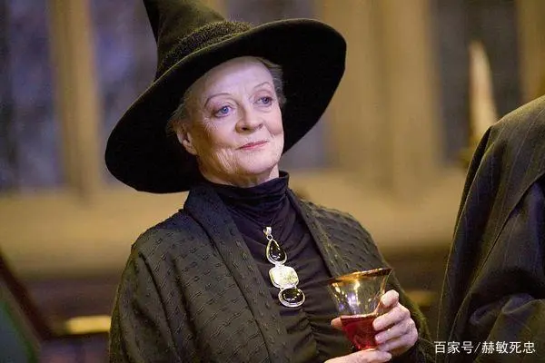

#  Harry Potter 
## 内容简介
### 《哈利·波特》系列小说，是英国女作家J.K.罗琳（J.K.Rowling）创作的魔幻系列小说。自出版以来，魔法世界中的人物形象逐渐风靡全球，全世界一次又一次掀起“哈利·波特”的阅读狂潮。但是，你足够了解罗琳的魔法世界吗？你知道哈利·波特的身世吗？你知道魔法世界中的神奇生物的来历吗……这是一部关于《哈利·波特》的百科全书，对《哈利·波特》系列小说进行了全方位的解析、介绍。忠实于原著，力求全面、生动地展示、再现整个哈利·波特魔法世界。 此书内容庞大，体系完整，包含了上千个词条，涵盖了J.K.罗琳所构建的整个哈利·波特魔法世界，对《哈利·波特》系列小说中呈现的人物、场所、职业、生物、魔法、物品、材料、娱乐、组织、服装、食物……进行了全面、详细、深度的解读。并在最后列出了哈利·波特魔法世界的历史年表，令读者可以系统完整地按时间顺序了解魔法世界的大事记。

## 四大学院介绍
> |格兰芬多     | 斯莱特林  |  拉文克劳  |   赫奇帕奇   |
> |--------|-------------|-----------|-------------|
> |红色      |   绿色 |    蓝色|黄色    |
> |狮子        |     蛇     |    鹰        |  獾     |
> |英勇无畏，奋不顾身。大胆无畏，喜爱冒险。|精明的斯莱特林，来自那一片泥潭，而渴望权力的他最喜欢那些血统纯正、有野心的少年。|睿智、公正、精明、博学、 聪明、有远见、好奇心也很强，喜欢钻研事物|正直，忠贞，诚实，不谓艰辛。|
> | | | | |

#### 主要人物介绍
 - 哈利波特
   > Harry James Potter，该作主角，是巫师夫妇詹姆·波特和莉莉·波特的独生子。他是伊诺特皮福雷的后裔（在国王十字车站与邓布利多谈话中证实），而书中的反派势力伏地魔，则是卡德马皮福雷之后代，因此两人有共同的祖先。哈利有着黑发绿眼，就像他的父亲一样，黑色的头发总是四处乱翘，有着波特家族的飞行天赋。宠物是霍格沃茨钥匙管理员鲁伯·海格在他十一岁生日时赠与的礼物——雪鸮海德薇（Hedwig）。尚在襁褓时被伏地魔企图谋杀，由于母亲牺牲自己施法保护使得伏地魔咒语反弹，他成为历史上唯一在索命咒下生还的人，额头上留有一道闪电形伤疤。在满十七岁时，终于摆脱未成年魔法侦测咒。他发现自己和伏地魔两者无法并存于世之后，就跟从邓布利多的指引，对抗伏地魔，但却成了被伏地魔控制的魔法部通缉的头号不受欢迎人物。后来在第七集最后大战返回霍格沃茨，获得多数教授、学生的支持，并打败伏地魔。
 
   

 - 赫敏
   >赫敏·格兰杰 （Hermione Jean Granger），出身一个麻瓜家庭。在书中以一个喜好钻研学术及无所不知的聪明女孩形象出现，有时显得独断专行，她的知识在他们许多的冒险旅程中证明有用。她唯一不喜爱的一个主科是占卜学，认为是“不精确”的学问。赫敏到霍格沃茨不久就成为全年级最聪明的学生。她不仅知道每个问题的答案，还记得读过的每本书的内容，并乐于将自己的知识告诉别人。因此她的求学生涯开始不久就获得了“格兰芬多万事通”的绰号，她因每堂课都积极举手回答问题并乐此不疲而扬名。

     
- 罗恩
  >罗恩·韦斯莱 （Ronald Bilius "Ron" Weasley），生于1980年3月1日，哈利在霍格沃茨最要好的朋友，书中的喜剧角色。韦斯莱家族是古老的纯血统家族，他们都拥有一头火焰般的红发。罗恩的爸爸是魔法部禁止滥用麻瓜物品司的员工，薪金不高，孩子又多，所以罗恩家境不富大多数的东西都是二手的，他很在意这一点。他和哈利是铁哥们，最后和赫敏结婚，并和哈利在魔法部成为同事。

  
- 邓布利多
  >霍格沃兹魔法学校教授阿不思·邓布利多 （Albus Percival Wulfric Brian Dumbledore），变形术教授兼霍格沃茨魔法学校校长，被公认为是当代最伟大的巫师，哈利最尊敬的人之一。

  
- 麦格
  >米勒娃·麦格 （Minerva McGonagall），变形术教授兼霍格沃茨魔法学校副校长和格兰芬多学院院长，并在最后邓布利多和斯内普死后成为校长

  
- 斯内普
  >西弗勒斯·斯内普 （Severus Snape），魔药课教授，斯莱特林学院院长，哈利六年级黑魔法防御术教授。在莉莉死后就成为凤凰社正式成员，在伏地魔要杀死哈利父母前是食死徒，之后为邓布利多的密探。邓布利多死后升为校长。深爱着莉莉·伊万斯。（斯教的一句Always是不是感动了好多哈迷）。

  
- 伏地魔
  >伏地魔（Lord Voldemort），原名汤姆·马沃罗·里德尔（Tom Marvolo Riddle）或小汤姆·里德尔（Tom Riddle Jr.），是英国作家J·K·罗琳的魔幻小说《哈利·波特》中的大反派，极端巫师纯血论恐怖组织“食死徒”（Death Eaters）的领袖，极度排斥麻瓜、麻瓜出身的巫师（泥巴种）以及不能施展魔法的巫师后裔（哑炮），两次巫师大战的发起者。有7个魂器，其中亲手制作了6个魂器【马沃罗·冈特的戒指、他本人的日记本、萨拉查·斯莱特林的挂坠盒、赫尔加·赫奇帕奇的金杯、罗伊纳·拉文克劳的冠冕、宠物蛇纳吉尼】，在试图杀死哈利·波特时，杀戮咒被哈利的母亲莉莉·波特的牺牲符咒反弹，自己的肉身被摧毁，有一部分灵魂进入了哈利的身体（使哈利成为第七个魂器）。《哈利·波特与火焰杯》中在小矮星彼得的帮助下恢复肉身。1998年5月2日在第二次巫师大战中使用老魔杖施展阿瓦达索命咒被咒语反弹身亡。

   

## ***故事介绍***
#### *《哈利波特1：魔法石》*
###### *从小寄养在姨丈家里的哈利波特，饱受姨丈一家人的歧视与欺侮，然而就在11岁生日那天，哈利·波特得知了自己的身世，他的生活也随之发生了天翻地覆的改变。原来，哈利的父母是两位善良的巫师，在同坏人的较量中被对方杀害了。为了继承父母的遗志，哈利来到了英国一所专门教授魔法与巫术的霍格华兹寄宿学院。进入霍格华兹学院后，哈利成了葛来分多一年级新生，与荣恩、妙丽成了形影不离的好朋友，许多成为魔法师的课程正在等着他研习，有飞行课、黑魔法防御术、魔药学与变形魔法等等，当然还有让所有巫师疯狂的魁地奇球赛.在一次与同学的争执中，哈利表现出超乎所有人想象的飞行技能，连他自己都很意外，传授飞行技术的麦教授因此推荐他加入葛来分多魁地奇球赛的队员，另一方面，魔药学的教授石内卜，似乎总是对哈利不怎幺友善，除了在课堂上刁难他外，还处处找哈利的麻烦，但是，哈利再一次偶然的机会里，发现石内卜严词威胁着懦弱的奎若教授，甚至石内卜脚上三头犬的咬痕，更可以证明哈利的推断是正确的：有股邪恶的阴谋在平静的霍格华兹里悄悄地滋长着，石内卜似乎就是这一切的关键人物。于是哈利、荣恩与妙丽这三个好朋友决定一同去探个究竟，阻止邪恶阴谋的发生。哈利、荣恩与妙丽这三个葛来分多一年级的新生，究竟有没有办法阻止这个不为人知的邪恶事件发生呢？而隐藏再这邪恶事件的幕后，又是谁在操纵这一切呢？哈利波特第一年的学生生涯可否安全地度过呢......*

#### *《哈利波特2：密室》*
###### *哈利波特结束了假期，即将回到霍格沃兹继续学习魔法。一个叫多比的家养小精灵警告哈利不要回到霍格沃兹，否则会陷入极大的危险。哈利没有听从多比的劝告，回到了霍格沃兹。很快，霍格沃兹发生了一连窜怪事:接二连三出现学生被石化，一直找不出原因。而哈利总能听到一种奇怪的声音，从墙壁里传出来。传说，霍格沃兹有一个密室，里面记录着伏地魔年轻时的秘密，只有斯莱特林的人才能打开密室。哈利偶然发现自己能听懂蛇说话，一时传闻是哈利打开了密室。难道多比所指的危险就隐藏在密室？*

- ### 下划线没打出来
  
<!-- dddddd --> 这里有注释！

[<狮子>](picture/狮子)

